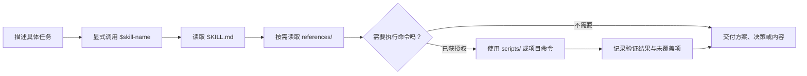

# Skills：可直接调用的 Agent 工作流合集

[](https://github.com/lzm0x219/skills/actions/workflows/validate.yml)
[](https://agentskills.io/specification)
[](#三步开始使用)
[](LICENSE)

这里收集了我在开发、电商和创作项目中反复使用的 Agent Skills。它们不是一组提示词模板，而是把任务流程、已知边界和验证方式写成可调用的 `SKILL.md`。

## 调用后会发生什么

你描述任务，再显式调用对应的 Skill。Agent 先读入口中的共同流程与边界，只在需要时再读参考资料或使用随 Skill 分发的工具。



`SKILL.md` 放每次调用都需要的步骤，`references/` 放版本化或任务专属细节，`scripts/` 放可重复执行的工具。这样既不把所有背景塞进一次调用，也不会在关键边界上只凭常识处理。

## 你会拿到什么

不同 Skill 的产物不同，但它们都力求把“下一步怎么做”变成可以继续评审、实现或交付的内容：

| 任务                 | Agent 会先理清什么                        | 常见产物                                       |
| -------------------- | ----------------------------------------- | ---------------------------------------------- |
| 设计接口、缓存或索引 | 数据规模、读写模式、内存与正确性边界      | 方案比较、复杂度取舍和验证计划                 |
| 建立 Rust Node addon | JavaScript 契约、生命周期、线程和发布边界 | 导出设计、薄绑定层建议和集成测试范围           |
| 维护 Zig 项目        | 目标 Zig 版本、构建图、依赖与运行时证据   | 版本匹配的改动方案、测试执行和运行时验证矩阵   |
| 初始化项目           | 目标目录、现有文件、技术栈、版本与冲突    | `planned`、`blocked` 或 `completed` 的明确报告 |
| 上架中国市场新品     | 商品事实、目标顾客、价格、合规与渠道      | 品牌决策、商品页成交、多渠道传播三层素材包     |
| 制作插画             | 参考图、文案、结构保留要求与交付限制      | 画面方案、生成提示、视觉 QA 或 PNG 产物检查    |

静态检查、测试或图像校验只能说明对应环节通过。它们不能替代市场验证、平台审核、目标运行时测试或实际发布结果。

## 三步开始使用

1. 先查看仓库里的 Skill。此命令不会改动当前项目：

   ```sh
   npx skills add lzm0x219/skills --list
   ```

2. 安装一个 Skill。下面的命令会为检测到的全部 Agent 安装 `napi-rs`：

   ```sh
   npx skills add lzm0x219/skills --skill napi-rs --agent '*'
   ```

3. 在 Agent 中显式调用：

   ```text
   $napi-rs 评审这个 addon 的 async、lifetime 与发布边界，不修改代码。
   ```

显式调用比隐式匹配可靠。新安装的 Skill 没出现时，先重启 Agent session，再用 `$skill-name` 调用。

### 其他安装方式

只为指定 Agent 安装：

```sh
npx skills add lzm0x219/skills \
  --skill napi-rs \
  --agent claude-code cursor codex
```

在多个项目中使用同一个 Skill：

```sh
npx skills add lzm0x219/skills \
  --skill napi-rs --agent '*' --global
```

安装全部 Skill：

```sh
npx skills add lzm0x219/skills --all
```

不安装时，也可以生成一次性 prompt：

```sh
npx skills use lzm0x219/skills@napi-rs
```

`npx` 首次运行可能下载第三方 `skills` CLI。安装前先用 `--list` 查看目标 `SKILL.md`、scripts 和相关 assets。默认保留交互确认。只有来源固定、内容已审阅的自动化才应使用 `--yes`。

## 按目标选择 Skill

| 你要做什么           | Skill                                                                             | 适用任务                                                  | 会得到什么                                        |
| -------------------- | --------------------------------------------------------------------------------- | --------------------------------------------------------- | ------------------------------------------------- |
| 设计数据结构与算法   | [`dsa-design`](skills/development/engineering/dsa-design/SKILL.md)                | 正确性、性能或资源边界取决于 DSA 选择                     | 根据数据形态、规模和约束比较方案，说明取舍        |
| 构建 Rust Node addon | [`napi-rs`](skills/development/framework/napi-rs/SKILL.md)                        | napi-rs 接入、迁移、异步、生命周期、打包与排障            | JavaScript contract、薄绑定层和测试边界           |
| 开发 Zig 项目        | [`zig`](skills/development/languages/zig/SKILL.md)                                | Zig 源码、`build.zig`、依赖、C 互操作、性能或迁移         | 匹配目标 Zig 版本的方案，以及构建和运行时验证矩阵 |
| 管理开发环境         | [`mise`](skills/development/tools/mise/SKILL.md)                                  | mise 工具版本、环境变量、tasks、lockfile、CI 或 IDE       | 可复现的工具链、任务入口和版本约束                |
| 建立项目基线         | [`bootstrap-project`](skills/development/workflows/bootstrap-project/SKILL.md)    | 受支持的 Zig、Rust、TypeScript/Node.js、Python 或 Go 项目 | 初始化计划，或带质量门的受支持项目基线            |
| 制作中国电商素材     | [`china-commerce-asset-pack`](skills/commerce/china-commerce-asset-pack/SKILL.md) | 非服饰新品上市、商品页优化、种草与私域推广                | 面向品牌决策、商品页成交和多渠道传播的素材包      |
| 重构水墨图文插画     | [`ink-wash-reframe`](skills/creative/ink-wash-reframe/SKILL.md)                   | 已授权参考图的米白水墨扁平视觉改造                        | 保留题材、构图和色彩关系的图像方案与视觉 QA       |
| 制作卷卷插图         | [`juanjuan-illustrations`](skills/creative/juanjuan-illustrations/SKILL.md)       | 中文文章、情绪内容与概念隐喻的怀旧手绘插图                | 配图计划、生成或编辑提示，以及 PNG 交付校验       |

`bootstrap-project`、`ink-wash-reframe` 与 `juanjuan-illustrations` 仅限显式手动调用。详情以各 Skill 的 `SKILL.md` 为准。

## 从提示到产物

下面的示例展示了应该怎样描述任务，以及每个 Skill 会把注意力放在哪里。

| 你可以这样说                                                                                 | 会先处理什么                                     | 预期结果                                       |
| -------------------------------------------------------------------------------------------- | ------------------------------------------------ | ---------------------------------------------- |
| `$zig 将这个 build.zig 迁移到已确认的 Zig 版本，并区分编译、测试执行和运行时验证。`          | 当前与目标版本、Build API 变化、测试是否真正执行 | 分步迁移方案，以及编译、执行和未验证目标的证据 |
| `$bootstrap-project 检查这个已有项目，并在不写入文件的前提下准备项目初始化计划。`            | 仓库根目录、技术栈、版本约束、已有工具和冲突     | `planned` 或 `blocked` 报告，不修改项目        |
| `$china-commerce-asset-pack 只为这个新品制作中国市场商品销售战略，先不要生成商详图片。`      | 商品事实、缺失信息、客群、定价和合规边界         | 供品牌决策使用的销售战略，不越过图片生成阶段   |
| `$ink-wash-reframe 将这张已授权的旅行照片改造为米白色平面水墨插画；在下方预留英文文案区域。` | 授权、构图、题材、色彩和文字区域                 | 有明确保留要求的图像改造方案与视觉检查点       |

也可以直接调用其他 Skill：

```text
$dsa-design 为这个百万级日志查询接口比较倒排索引、B+ 树和缓存策略。
$mise 为此项目设计可复现的工具、环境变量和测试任务，不修改文件。
$juanjuan-illustrations 为这篇中文文章规划三张卷卷插图，暂不生成图像。
```

## 使用边界

- 不同 Agent 的发现路径和隐式匹配能力不同，安装不等于一定自动触发
- `napi-rs`、`zig` 和 `mise` 遇到精确 API、CLI 参数、目标支持或发布流程时，应查当前官方文档
- 脚本执行、联网、发布、外部写入、提交或覆盖文件，需要与任务相符的明确授权
- Skill 不是安全沙箱。使用前仍要检查代码、凭据范围、目标路径与实际副作用

## 验证能说明什么

这些检查各自只回答一个问题。局部通过不等于全局成功：

| 检查                | 能证明                                                | 不能证明                                         |
| ------------------- | ----------------------------------------------------- | ------------------------------------------------ |
| 静态验证            | 元数据、路径、链接、行为契约和源码断言符合仓库规则    | 真实模型或每个 Agent 都会给出正确答案            |
| 固定答案回归        | 运行器与断言可稳定识别已知输出                        | 当前模型仍会生成这些输出                         |
| 实时 Codex 评估     | 当前 Codex CLI、模型和 Skill 在某场景满足最终输出断言 | 其他 Agent 行为相同，或模型内部是否加载过 Skill  |
| 隔离 workspace 评估 | 复制 fixture 的输入、输出、命令结果和预期路径变更一致 | 被调用命令不会影响 subprocess sandbox 之外的系统 |
| 文档与发行检查      | 检查时官方索引、链接或 Zig 稳定发行信息可访问         | 未来版本、未运行平台或真实项目一定可用           |

默认 GitHub Actions 会运行静态验证、运行器单元测试和固定答案回归，不调用模型，也不访问官方文档网站。

## 仓库布局

```text
.
├── skills/
│   ├── creative/{ink-wash-reframe,juanjuan-illustrations}/
│   ├── commerce/china-commerce-asset-pack/
│   └── development/
│       ├── engineering/dsa-design/
│       ├── framework/napi-rs/
│       ├── languages/zig/
│       ├── tools/mise/
│       └── workflows/bootstrap-project/
├── capabilities/map.json
├── evals/
│   ├── fixtures/<skill>/
│   ├── workspaces/<skill>/
│   └── <skill>.behavior.json
├── docs/behavior-evals.md
├── scripts/{run_behavior_evals,run_workspace_evals,validate_skills}.py
├── tests/
└── .github/workflows/validate.yml
```

| 路径                           | 职责                                              |
| ------------------------------ | ------------------------------------------------- |
| `skills/**/SKILL.md`           | 可移植入口、任务流程与调用边界                    |
| `skills/**/references/`        | 仅在任务需要时读取的细节与官方文档路由            |
| `skills/**/scripts/`           | 随 Skill 分发的确定性工具                         |
| `skills/**/agents/openai.yaml` | 可选 Codex UI metadata、默认 prompt 与调用策略    |
| `evals/`                       | 行为契约、固定答案与 workspace fixtures           |
| `capabilities/map.json`        | 已实现 Composite Skills 及安全边界的最小 registry |
| `scripts/` 与 `tests/`         | 仓库验证与评估运行器                              |

分类目录、`agents/openai.yaml` 和 `evals/` 是本仓库的约定，不是 [Agent Skills specification](https://agentskills.io/specification) 的必需部分。只消费可移植 Skill 包的 Agent 只需要 `SKILL.md` 及其引用的 `references/` 或 `scripts/`。

## 本地检查与维护

提交前运行离线检查：

```sh
python3 scripts/validate_skills.py
python3 -m unittest discover -s tests -p 'test_*.py'
python3 scripts/run_behavior_evals.py \
  --skill <skill-name> --answers evals/fixtures/<skill-name>
```

例如，检查 `china-commerce-asset-pack`：

```sh
python3 scripts/run_behavior_evals.py \
  --skill china-commerce-asset-pack \
  --answers evals/fixtures/china-commerce-asset-pack
```

要刷新或发布 napi-rs、mise 的官方文档路由，或更新 Zig 发行版声明时，再运行网络检查：

```sh
node skills/development/framework/napi-rs/scripts/verify-official-docs-coverage.mjs \
  --check --verify-links
node skills/development/tools/mise/scripts/verify-official-docs-inventory.mjs \
  --check --verify-links
node skills/development/languages/zig/scripts/verify-official-release.mjs \
  --check --verify-links
```

新增或修改 Skill 时：

1. 维护 `skills/<category>/<skill-name>/SKILL.md`
2. 在 `evals/<skill-name>.behavior.json` 定义源码断言与必需场景
3. 为每个场景添加 `evals/fixtures/<skill-name>/<case-id>.txt`
4. 对 workspace 写入行为添加隔离输入和期望
5. 更新清单并运行全部离线检查

把较长的任务细节放进 `references/`，把确定性工具放进 `scripts/`。 `SKILL.md` 只保留每次调用都需要的流程和边界。

## 许可证

本仓库采用 [Apache License 2.0](LICENSE)。
