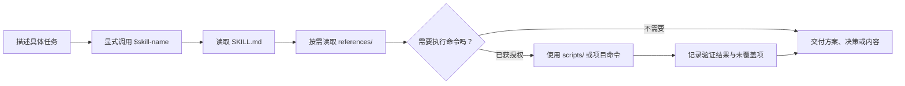

# 使用与维护说明

[返回 Skills 清单](../README.md)

这里保留手动安装、工作原理、使用边界、验证范围和仓库维护命令。只想开始使用时，直接复制 README 中的[安装提示词](../README.md#让-ai-帮你安装)。

## 手动安装

以下命令使用 [Skills CLI](https://github.com/vercel-labs/skills#readme)。`npx` 首次运行可能下载 CLI；`--list` 只列出 Skill，不安装到项目。

```sh
npx skills add lzm0x219/skills --list
```

下面以 Codex 为例。使用其他工具时，将 `codex` 替换为 CLI 支持的 Agent 标识，例如 `claude-code` 或 `cursor`。

### 安装一个 Skill

默认安装到当前项目：

```sh
npx skills add lzm0x219/skills --skill napi-rs --agent codex
```

在多个项目中使用时，安装到用户级目录：

```sh
npx skills add lzm0x219/skills --skill napi-rs --agent codex --global
```

### 安装全部 Skills

只安装到指定工具：

```sh
npx skills add lzm0x219/skills --skill '*' --agent codex
```

### 安装到多个工具

明确指定工具：

```sh
npx skills add lzm0x219/skills \
  --skill napi-rs --agent claude-code cursor codex
```

为检测到的全部工具安装同一个 Skill：

```sh
npx skills add lzm0x219/skills --skill napi-rs --agent '*'
```

`--all` 会为所有 Agent 安装全部 Skills，并跳过交互提示；它不等同于“只为当前工具安装全部”。只有确实需要这个范围时才使用。

### 不安装，生成一次性提示词

```sh
npx skills use lzm0x219/skills@napi-rs
```

此命令将选中的 Skill 文件放入临时目录，并把生成的提示词输出到终端，不进行持久安装。

### 调用与发现

显式指定 Skill 名称有助于让 AI 选择正确流程。不同工具的调用语法、发现路径和隐式匹配能力不同；新安装的 Skill 没出现时，先重启会话，再检查工具的 Skill 清单。

`bootstrap-project`、`reference-style-reframe` 与 `juanjuan-illustrations` 仅限显式手动调用。详细边界以各自的 `SKILL.md` 为准。

## 工作原理

你描述任务，再显式调用对应的 Skill。Agent 先读入口中的共同流程与边界，只在需要时再读参考资料或使用随 Skill 分发的工具。



`SKILL.md` 放每次调用都需要的步骤，`references/` 放版本化或任务专属细节，`scripts/` 放可重复执行的工具。这样既不把所有背景塞进一次调用，也不会在关键边界上只凭常识处理。

## 使用边界

- 安装不等于一定会自动触发；以当前工具的实际发现与调用结果为准。
- `napi-rs`、`zig` 和 `mise` 遇到精确 API、CLI 参数、目标支持或发布流程时，应查当前官方文档。
- 执行范围依据当前请求与已有授权确定；发布、外部发送、全局配置或覆盖已有文件等动作，需要覆盖该动作的授权。
- Skill 是任务指南，不是安全沙箱。使用前检查代码、凭据范围、目标路径与实际副作用。
- 静态检查、测试或图像校验只说明对应环节通过，不能替代市场验证、平台审核、目标运行时测试或实际发布结果。

## 验证能说明什么

这些检查各自只回答一个问题。局部通过不等于全局成功：

| 检查                | 能证明                                                | 不能证明                                         |
| ------------------- | ----------------------------------------------------- | ------------------------------------------------ |
| 静态验证            | 元数据、路径、链接、行为契约和源码断言符合仓库规则    | 真实模型或每个 Agent 都会给出正确答案            |
| 固定答案回归        | 运行器与断言可稳定识别已知输出                        | 当前模型仍会生成这些输出                         |
| 实时 Codex 评估     | 当前 Codex CLI、模型和 Skill 在某场景满足最终输出断言 | 其他 Agent 行为相同，或模型内部是否加载过 Skill  |
| 隔离 workspace 评估 | 复制 fixture 的输入、输出、命令结果和预期路径变更一致 | 被调用命令不会影响 subprocess sandbox 之外的系统 |
| 文档与发行检查      | 检查时官方索引、链接或 Zig 稳定发行信息可访问         | 未来版本、未运行平台或真实项目一定可用           |

默认 GitHub Actions 会运行静态验证、运行器单元测试和固定答案回归，不调用模型，也不访问官方文档网站。

运行方式、模型对照与隔离策略见[行为评测说明](behavior-evals.md)。

## 仓库布局

```text
.
├── skills/
│   ├── creative/{reference-style-reframe,juanjuan-illustrations}/
│   ├── commerce/china-commerce-asset-pack/
│   └── development/
│       ├── engineering/dsa-design/
│       ├── framework/napi-rs/
│       ├── languages/zig/
│       ├── tools/mise/
│       └── workflows/{bootstrap-project,durable-execution-state}/
├── capabilities/map.json
├── evals/
│   ├── fixtures/<skill>/
│   ├── workspaces/<skill>/
│   └── <skill>.behavior.json
├── docs/behavior-evals.md
├── scripts/{run_behavior_evals,run_workspace_evals,validate_skills}.py
├── tests/
└── .github/workflows/validate.yml
```

| 路径                           | 职责                                              |
| ------------------------------ | ------------------------------------------------- |
| `skills/**/SKILL.md`           | 可移植入口、任务流程与调用边界                    |
| `skills/**/references/`        | 仅在任务需要时读取的细节与官方文档路由            |
| `skills/**/scripts/`           | 随 Skill 分发的确定性工具                         |
| `skills/**/agents/openai.yaml` | 可选 Codex UI metadata、默认 prompt 与调用策略    |
| `evals/`                       | 行为契约、固定答案与 workspace fixtures           |
| `capabilities/map.json`        | 已实现 Composite Skills 及安全边界的最小 registry |
| `scripts/` 与 `tests/`         | 仓库验证与评估运行器                              |

分类目录、`agents/openai.yaml` 和 `evals/` 是本仓库的约定，不是 [Agent Skills specification](https://agentskills.io/specification) 的必需部分。只消费可移植 Skill 包的 Agent 只需要 `SKILL.md` 及其引用的 `references/` 或 `scripts/`。

## 本地检查与维护

以下命令从仓库根目录运行。

### 离线检查

```sh
oxfmt .
oxfmt --check .
python3 scripts/validate_skills.py
python3 -m unittest discover -s tests -p 'test_*.py'
python3 scripts/run_behavior_evals.py \
  --skill <skill-name> --answers evals/fixtures/<skill-name>
```

将 `<skill-name>` 换成改动的 Skill，例如：

```sh
python3 scripts/run_behavior_evals.py \
  --skill china-commerce-asset-pack \
  --answers evals/fixtures/china-commerce-asset-pack
```

保留 `--answers` 才是离线固定答案检查；省略它会调用已认证的 Codex 服务。

### 官方文档与发行检查

只在刷新或发布 napi-rs、mise 的官方文档路由，或更新 Zig 发行版声明时运行：

```sh
node skills/development/framework/napi-rs/scripts/verify-official-docs-coverage.mjs \
  --check --verify-links
node skills/development/tools/mise/scripts/verify-official-docs-inventory.mjs \
  --check --verify-links
node skills/development/languages/zig/scripts/verify-official-release.mjs \
  --check --verify-links
```

### 新增或修改 Skill

1. 维护 `skills/<category>/<skill-name>/SKILL.md`。
2. 在 `evals/<skill-name>.behavior.json` 定义源码断言与必需场景。
3. 为每个场景添加 `evals/fixtures/<skill-name>/<case-id>.txt`。
4. 对 workspace 写入行为添加隔离输入和期望。
5. 更新 README 分类清单，运行适用检查及仓库必需检查。

入口保留共同流程，任务细节放进 `references/`，确定性工具放进 `scripts/`。修改阶段门或指令时，遵循 [Skill 编写约定](agents/skill-authoring.md)。
